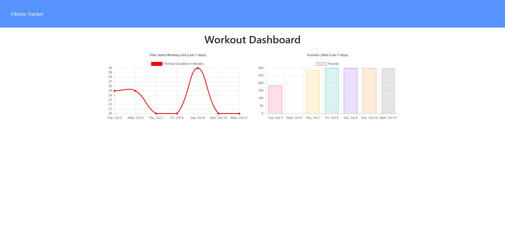
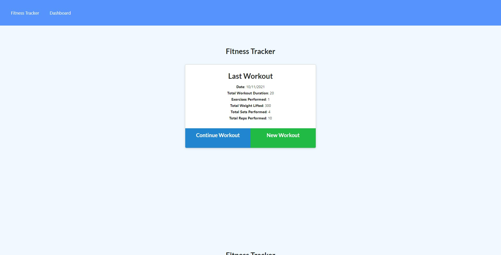

# NoSQL Workout Tracker
    

  
## Description
  A wokout tracker to help you keep track of your recent workouts!
  
## Table of Contents
  - [Usage](#Usage)
  - [Usage](#Usage)
  - [Contributing](#Contributing)
  - [Commands](#Commands)
  - [Screenshots](#Screenshots)
  - [Credits](#Credits)
  - [License](#License)
  - [Questions](#Questions)
  
## Usage
  Use this app to keep track of your most recent exercises!  Log the exercise and the app will keep track for you and also provide you with handy graphs on the Dashboard page. 
  
  
## Contributing 
  You may contact me with suggestions on additions to the project.
  
## Commands
 mongo, node, nmp run seed, npm start.

## Screenshots

## Credits
  Ashby Blakely 
  
  ## License 
  [Link to the MIT license used](https://opensource.org/licenses/MIT)  
  
 
## Questions
  [Link to GitHub Profile](https://github.com/AshbyLB) 
  Feel free to email me at Ashbyleeblakely@gmail.com if you have any questions.
